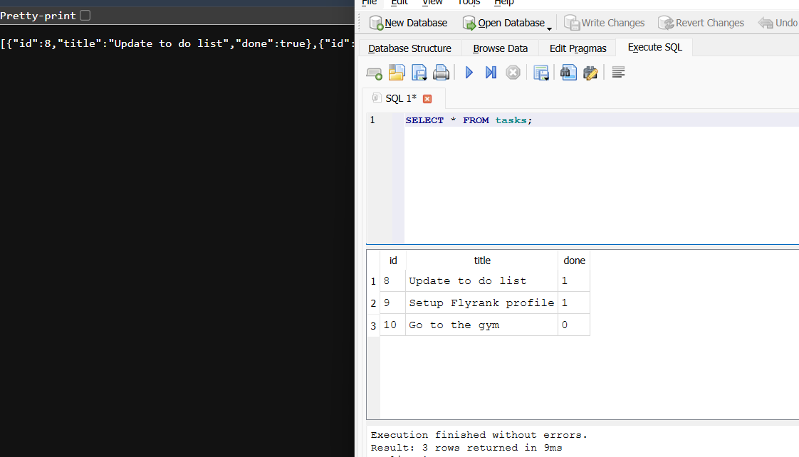
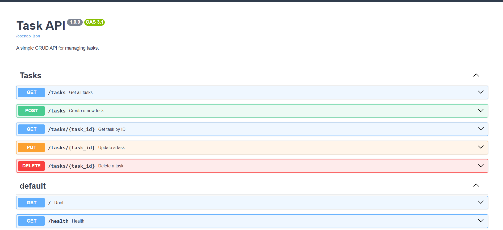
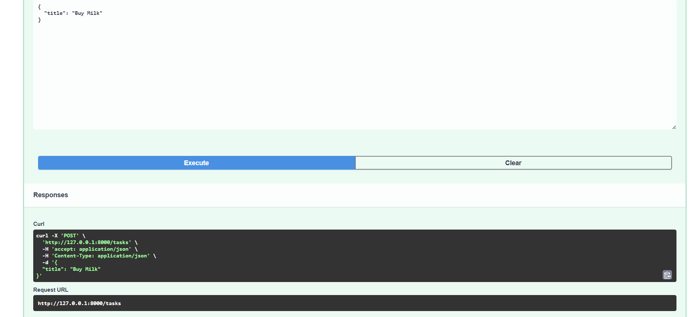

# Task API

A simple CRUD Task Management API built with **FastAPI**. This project implements basic CRUD (Create, Read, Update, Delete) operations for managing tasks and includes automatically generated interactive API documentation using Swagger UI.

## Features

- Create, retrieve, update, and delete tasks
- Persistent task storage using SQLite
- Automatic database and table creation
- Automatic seeding of example tasks when the database is empty
- Filter tasks by completion status using SQL `WHERE`
- Search tasks by title using SQL `LIKE`
- Pagination using SQL `LIMIT` and `OFFSET`
- Alphabetical task sorting using SQL `ORDER BY`
- Task statistics using SQL `COUNT()`
- Interactive Swagger documentation
## Requirements

* Python 3.10+
* FastAPI
* Uvicorn

## Installation

Clone the repository:

```bash
git clone https://github.com/Ladinski/CRUD-FastAPI.git
cd task-api
```

Create a virtual environment:

```bash
python -m venv venv
```

Activate the virtual environment:

**Windows (PowerShell)**

```powershell
.\venv\Scripts\Activate.ps1
```

**Windows (Command Prompt)**

```cmd
venv\Scripts\activate
```

Install the project dependencies:

```bash
pip install -r requirements.txt
```

Run the application:

```bash
uvicorn main:app --reload
```

Open your browser:

* API: http://127.0.0.1:8000
* Swagger UI: http://127.0.0.1:8000/docs

## Database

This project uses SQLite for persistent task storage. SQLite was chosen because it is lightweight, requires no separate database server, and stores the entire database in a single file, making it suitable for a small CRUD API.

The database is stored in:

```text
tasks.db
```

The database and `tasks` table are created automatically when the application starts if they do not already exist. If the table is empty, the application also inserts three example tasks.

Unlike the previous in-memory implementation, tasks stored in SQLite remain available after the FastAPI server is restarted.

### Database Schema

The `tasks` table contains:

| Column | Type | Description |
| --- | --- | --- |
| `id` | INTEGER | Primary key and unique task ID |
| `title` | TEXT | Task title |
| `done` | BOOLEAN | Whether the task is completed |

### Example SQL Query

One query I executed manually using DB Browser for SQLite was:

```sql
SELECT * FROM tasks WHERE done = 1;
```

This returns only completed tasks.

I also verified that changes made directly to the SQLite database were immediately reflected by the API through `GET /tasks`.

### Database Viewer



## API Endpoints

| Method | Endpoint           | Description                   |
| ------ | ------------------ | ----------------------------- |
| GET    | `/`                | Returns basic API information |
| GET    | `/health`          | Returns the API health status |
| GET    | `/tasks`           | Returns all tasks             |
| GET    | `/tasks/{task_id}` | Returns a specific task by ID |
| POST   | `/tasks`           | Creates a new task            |
| PUT    | `/tasks/{task_id}` | Updates an existing task      |
| DELETE | `/tasks/{task_id}` | Deletes a task                |

## Pagination

The `GET /tasks` endpoint supports pagination using the `limit` and `offset` query parameters.

Example:

```bash
GET /tasks?limit=2&offset=2
```

This request skips the first two tasks and returns the next two.

Real-world APIs typically do not return every record at once because datasets can become very large. Pagination improves performance, reduces bandwidth usage, lowers memory consumption, and provides faster response times for clients.

## Example curl Output

```bash
curl -i http://127.0.0.1:8000/tasks
```

Example output:

```http
HTTP/1.1 200 OK
date: Thu, 30 Jul 2026 15:00:00 GMT
server: uvicorn
content-type: application/json
content-length: 171

[
  {
    "id": 1,
    "title": "Update to do list",
    "done": true
  },
  {
    "id": 2,
    "title": "Setup Flyrank profile",
    "done": true
  },
  {
    "id": 3,
    "title": "Go to the gym",
    "done": false
  }
]
```

## Swagger Documentation




## Technologies Used

* Python
* FastAPI
* Uvicorn
* Pydantic
* Swagger UI (OpenAPI)

## Author

Borjan Ladinski
